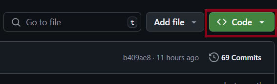

# Quản Lý Sách Nói và Văn Bản TTS
---
`Vodka Audiobook` là nền tảng cung cấp kho sách nói đa dạng, giúp người dùng dễ dàng tiếp cận tri thức mọi lúc, mọi nơi thông qua giọng đọc tự nhiên và chất lượng cao.

Với thư viện sách phong phú, từ văn học, kinh doanh, kỹ năng sống đến giáo trình học thuật, Sách Nói hướng đến mọi đối tượng, từ học sinh, sinh viên đến người đi làm bận rộn. Người dùng có thể nghe sách miễn phí hoặc đăng ký gói cao cấp để trải nghiệm nội dung độc quyền.

Website được thiết kế tối ưu, thân thiện với người dùng, hỗ trợ tìm kiếm nhanh, điều chỉnh tốc độ phát, chatbot, với các tính năng cá nhân hóa như: lưu danh sách yêu thích, đánh dấu sách đã đọc,... mang đến trải nghiệm nghe sách tiện lợi và thú vị.

Website còn hỗ trợ chuyển đổi văn bản sang giọng nói (Text-to-Speech - TTS). Việc tích hợp Text-to-Speech (TTS) vào website Sách Nói nhằm mở rộng khả năng tiếp cận nội dung, giúp người dùng dễ dàng chuyển đổi văn bản thành giọng nói tự nhiên. Tính năng này hỗ trợ người khiếm thị, giúp học tập và làm việc hiệu quả hơn bằng cách nghe tài liệu mọi lúc, mọi nơi. Điều này không chỉ giúp mở rộng kho sách nói mà còn tạo ra một nền tảng linh hoạt, tối ưu cho việc tiếp cận tri thức.

### Tính năng
---
- Xác thực người dùng (đăng ký, đăng nhập)
- Nghe sách nói trực tuyến
- Tìm kiếm & phân loại sách
- Chuyển văn bản thành giọng nói (TTS)
- Theo dõi lịch sử nghe và lưu trữ sách yêu thích
- Hỗ trợ các tùy chọn tốc độ đọc khác nhau.
- Quản lý danh mục, tác giả, và tệp âm thanh.
- Chatbot hỗ trợ người dùng 

### Thông tin kĩ thuật
---
- Công nghệ sử dụng (Frontend:HTML , CSS , Javascript  | Backend: Django )
- Cơ sở dữ liệu (MySQL)
- Hosting & Deployment (AWS EC2)
- Hỗ trợ trình duyệt (Chrome, Cốc Cốc, Google, Firefox, Safari, v.v.)


### Cách cài đặt & chạy
---
**Yêu cầu hệ thống**: Node.js, js , Django, cơ sở dữ liệu, v.v.

**1. Clone repository từ GitHub:**

Sao chép kho lưu trữ về máy cục bộ. Nút này sẽ hiển thị URL để chạy lệnh.



Sau đó chạy lệnh này trong terminal

    git clone <repository-url> 
  
**2. Chuyển vào source code**
```c
cd sachnoi
```
**3. Tải các thư viện cần thiết:**
```c
pip install -r requirements.txt
```
**4. Chạy code**
```c
python manage.py makemigrations
python manage.py migrate
python manage.py runserver
```

### Đội ngũ tham gia phát triển website
---
- Mentor: Đinh Quốc Đại
- Nguyễn Đăng Huân
- Đỗ Sỹ Việt
- Vũ Mạnh Hiếu
- Võ Minh Trí
- Vũ Thị Thu Duyên
